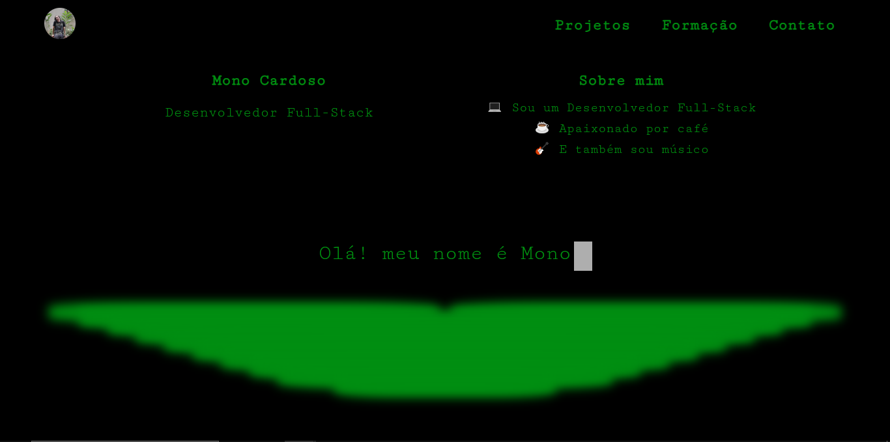

<h1 align="center" style="font-weight: bold;">Portfólio Mono Cardoso 💻</h1>

<p align="center">
 <a href="#technologies">Technologies</a> • 
 <a href="#started">Getting Started</a> • 
 <a href="#author">Author</a>
</p>

<p align="center">
    <b>
      Meu portfólio contém: <br />
      Projetos | Formação | Contato
    </b>
</p>

<p align="center">
     <a href="https://monosodrac.vercel.app/">📱 Visite o Projeto</a>
</p>

<h2 id="layout">🎨 Layout</h2>

<p align="center">
    
</p>

<h2 id="technologies">💻 Technologies</h2>

- react
- styled components
- react router dom
- aos library

<h2 id="started">🚀 Getting started</h2>

<h3>Prerequisites</h3>

- [NodeJS](https://github.com/)

<h3>Cloning</h3>

```bash
git clone https://github.com/monosodrac/portfolio-sodrac.git
```

<h3>Starting</h3>

```bash
cd portfolio-sodrac
npm install
npm run dev
```

<h2 id="author">Author</h2>

<table>
  <tr>
    <td align="center">
      <a href="https://linktr.ee/monosodrac">
        <br>
        <sub>
          <b>Mono Cardoso</b>
        </sub>
      </a>
    </td>
  </tr>
</table>
